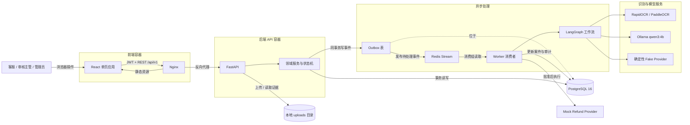
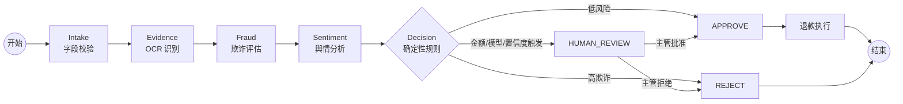
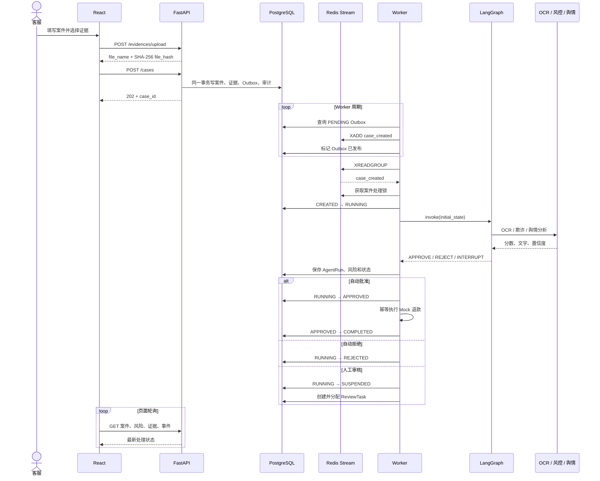

# 多 Agent 协同客诉舆情退赔决策系统：技术栈与前后端架构详解

> 本文基于当前代码库整理，目标是帮助开发者从“技术选型、模块职责、请求链路、数据流、运行方式、实现边界”六个角度理解系统，而不是仅罗列依赖名称。
>
> 文档核对日期：2026-08-20；当前应用版本：`0.1.0`。

## 1. 一句话认识这个项目

这是一个面向客诉退款场景的前后端分离系统：客服提交退款案件与证据图片，后端异步执行 OCR、欺诈评估和舆情分析，再由确定性业务规则自动批准、拒绝或转人工审核，最后执行模拟退款并保留完整审计记录。

系统中的“大模型”只负责提供风险与情绪分析信号，**不会直接决定资金操作**。真正的退款决策由可配置、可审计的 Python 规则完成。

---

## 2. 技术栈总览

| 层级 | 主要技术 | 当前用途 |
|---|---|---|
| 前端语言 | TypeScript 5.5 | 页面、接口类型与组件逻辑 |
| 前端框架 | React 18.3 | 构建单页应用 |
| 前端路由 | React Router DOM 6.26 | 登录页、案件列表、新建页、详情页路由 |
| 前端构建 | Vite 5.4 | 开发服务器、API 代理、生产打包 |
| 前端样式 | 原生 CSS | 全局设计变量、布局、表格、表单和状态样式 |
| 后端语言 | Python 3.12 | API、业务逻辑、工作流与后台任务 |
| Web 框架 | FastAPI 0.115+ | REST API、依赖注入、参数校验和 OpenAPI 文档 |
| ASGI 服务器 | Uvicorn 0.30+ | 运行 FastAPI；容器中配置 4 个 worker |
| 数据校验 | Pydantic 2 / pydantic-settings | 请求响应模型与环境变量配置 |
| ORM | SQLAlchemy 2 | 数据模型、查询、事务与乐观锁 |
| 数据库 | PostgreSQL 16 | 保存案件、证据、用户、风险、审核、审计等权威数据 |
| 数据库迁移 | Alembic 1.13 | 创建和升级数据库结构 |
| 消息与缓存 | Redis 7 | Redis Stream、消费组、处理锁、重试计数、恢复检查点 |
| 多 Agent 编排 | LangGraph 0.2+ | 定义 Agent 节点、有条件分支及人工审核中断 |
| OCR | RapidOCR / PaddleOCR / Fake | 从证据图片提取文字和置信度 |
| 本地大模型 | Ollama + `qwen3:4b` | 可选的欺诈风险与舆情情绪分析 |
| 鉴权 | JWT + bcrypt | 登录令牌、密码哈希和角色权限控制 |
| HTTP 客户端 | HTTPX | 后端访问 Ollama HTTP API |
| 容器化 | Docker Compose | 统一编排 PostgreSQL、Redis、后端、Worker 和前端 |
| Web 服务 | Nginx Alpine | 托管前端静态文件并反向代理 `/api/` |
| 测试 | pytest / pytest-asyncio | API、工作流、状态机、幂等、并发和 Worker 测试 |
| 压测 | Locust | HTTP 场景负载测试 |

### 2.1 当前锁定程度

前端 `package.json` 使用 `^` 范围，后端 `requirements.txt` 使用上下界范围，例如 `fastapi>=0.115,<1`。因此上表中的部分版本是允许范围，而不是完整锁定版本。前端存在 `package-lock.json`，实际安装版本可由它复现；后端当前没有单独的锁文件。

---

## 3. 系统整体架构



### 3.1 为什么拆成 API 与 Worker

创建案件接口只负责校验并写入数据库，随后立即返回 HTTP `202 Accepted`。OCR 和模型分析可能耗时或失败，不应阻塞用户请求，因此由独立 Worker 异步执行。

这种拆分带来四个好处：

1. API 响应更快，不被 OCR 或本地模型延迟拖住。
2. Worker 可以独立扩容，Redis 消费组负责分发任务。
3. 失败消息可以重试，并在超过次数后进入死信 Stream。
4. 案件创建与事件生成放在同一数据库事务中，降低“数据已写入但任务丢失”的概率。

---

## 4. 前端详解

### 4.1 前端目录结构

```text
frontend/
├── src/
│   ├── main.tsx                 # React 挂载入口
│   ├── App.tsx                  # 路由、鉴权外壳、侧边栏和顶部栏
│   ├── api.ts                   # 所有后端请求与 token 管理
│   ├── types.ts                 # API 数据类型和状态文案
│   ├── index.css                # 全局视觉样式
│   ├── pages/
│   │   ├── Login.tsx            # 登录
│   │   ├── CaseList.tsx         # 案件工作台
│   │   ├── CaseCreate.tsx       # 新建退款申请
│   │   └── CaseDetail.tsx       # 案件详情与轮询
│   └── components/
│       ├── AgentFlow.tsx        # Agent 流程状态展示
│       └── ReviewPanel.tsx      # 人工审核操作面板
├── vite.config.ts               # Vite 与开发代理
├── nginx.conf                   # 生产静态服务与 API 代理
├── Dockerfile                   # Node 构建 + Nginx 运行
└── package.json                 # 依赖和脚本
```

### 4.2 页面与路由

系统使用 `HashRouter`，浏览器 URL 形态为 `/#/cases/...`。Hash 路由不会要求服务器为每个前端路径返回 `index.html`，适合简单静态部署。

| 路由 | 页面 | 权限 | 作用 |
|---|---|---|---|
| `/login` | `Login.tsx` | 公开 | 使用用户名和密码换取 JWT |
| `/` | `CaseList.tsx` | 已登录 | 案件列表、统计、待审核任务、管理员审计日志 |
| `/cases/new` | `CaseCreate.tsx` | 已登录 | 上传证据并创建退款案件 |
| `/cases/:id` | `CaseDetail.tsx` | 已登录 | 查看案件、风险、OCR、Agent 流程、时间线和审核面板 |

`RequireAuth` 只检查浏览器中是否存在 token；真正的身份与权限校验仍在后端完成，不能把前端路由守卫当作安全边界。

### 4.3 前端状态管理

项目没有引入 Redux、Zustand 或 React Query，而是使用：

- React `useState` 保存页面局部状态；
- `useEffect` 执行加载与定时刷新；
- `useMemo` 计算案件统计；
- `useCallback` 固定详情页加载函数；
- `localStorage` 保存 token、角色和用户名。

这是符合当前规模的轻量方案。它的代价是跨页面缓存、请求去重和失效管理都需要手工处理。

### 4.4 API 封装

`frontend/src/api.ts` 是前端的网络边界：

1. 所有 JSON 请求以 `/api/v1` 为前缀。
2. 从 `localStorage` 读取 JWT，加入 `Authorization: Bearer ...`。
3. 收到 `401` 时清除本地会话并跳转登录页。
4. 将后端统一错误结构转换成 JavaScript `Error`。
5. 图片上传使用 `FormData`，不会手动设置 `Content-Type`。
6. 证据图片以 Blob 读取，再转为 `Object URL` 展示。

开发环境中，Vite 将 `/api` 代理到 `http://localhost:8001`；生产环境中，Nginx 负责同路径代理。

### 4.5 页面数据刷新策略

当前没有 WebSocket。系统采用短轮询：

- 案件列表每 5 秒刷新；
- 案件详情每 2.5 秒刷新；
- 详情页并行请求案件、事件、风险、证据和审核任务。

这种方式实现简单，适合 MVP；案件量或在线用户增大后，会产生大量重复请求。后端已经依赖 `sse-starlette`，但当前路由中尚未提供 SSE 接口。

### 4.6 前端角色体验

| 角色 | 可见功能 |
|---|---|
| `agent` | 查看案件、创建申请、查看处理详情 |
| `supervisor` | 拥有 `agent` 能力，并可查看与处理人工审核任务 |
| `admin` | 拥有主管能力，并可查看全局审计日志 |

前端通过角色决定是否展示按钮和面板；后端通过依赖注入执行真正的 RBAC 校验。

### 4.7 前端当前特点与边界

**已经实现：**

- 完整登录、列表、新建、详情和人工审核流程；
- TypeScript 类型定义；
- 证据图片上传及展示；
- 风险分数、OCR 结果、流程状态和事件时间线；
- 生产构建和 Nginx 容器部署。

**尚未引入或需注意：**

- 没有前端自动化测试；
- 没有统一请求取消机制，轮询请求可能在慢网络下重叠；
- JWT 存在 `localStorage`，若页面出现 XSS，token 可能被读取；
- 部分组件使用行内样式，后续维护主题时成本较高；
- `AgentFlow` 展示的是根据案件总状态推算的流程状态，不是读取每个 `AgentRun` 的实时执行状态；
- 统计卡由当前最多 200 条案件在浏览器端计算，后端已有 `/cases/statistics`，但前端尚未使用。

---

## 5. 后端详解

### 5.1 后端分层

```text
backend/app/
├── main.py                 # FastAPI 应用入口、异常处理、路由注册
├── config.py               # 环境变量配置
├── api/
│   ├── deps.py             # 数据库和鉴权依赖
│   ├── schemas.py          # Pydantic 请求/响应模型
│   ├── errors.py           # 统一业务错误
│   └── routes/             # REST API
├── domain/
│   ├── models.py           # SQLAlchemy 数据模型
│   ├── case_service.py     # 创建案件、审计、人工决策
│   ├── decision_service.py # 决策接口的幂等封装
│   ├── review_service.py   # 审核任务分配
│   ├── state_machine.py    # 案件合法状态迁移
│   └── services.py         # 状态更新与乐观锁
├── workflow/
│   ├── state.py            # LangGraph 共享状态结构
│   ├── graph.py            # 工作流节点和分支
│   └── runner.py           # 执行工作流并持久化结果
├── agents/
│   ├── nodes.py            # Intake、Evidence、Fraud、Sentiment 节点
│   └── providers.py        # OCR、Ollama 与 Fake Provider
├── policy/
│   └── decision_policy.py  # 确定性资金决策规则
├── infrastructure/
│   ├── db.py               # SQLAlchemy Engine 与 Session
│   ├── redis_client.py     # Redis 连接
│   ├── streams.py          # Stream 名称和发布辅助
│   ├── outbox.py           # 事务 Outbox 发布器
│   ├── idempotency.py      # 幂等记录
│   ├── lock.py             # 分布式锁辅助
│   ├── security.py         # bcrypt 与 JWT
│   ├── refund.py           # 退款 Provider；当前为 Mock
│   └── redaction.py        # 敏感字段脱敏
├── worker/
│   └── consumer.py         # Redis Stream 消费、重试和死信
└── scripts/
    ├── seed.py             # 初始化演示用户
    ├── check_models.py     # 模型连通性检查
    └── verify_ocr.py       # OCR 验证
```

这种目录组织接近“API 层 → 领域层 → 工作流层 → 基础设施层”的分层架构。路由尽量薄，业务规则集中在服务、状态机与策略文件中。

### 5.2 FastAPI 应用入口

`backend/app/main.py` 完成四件事：

1. 创建应用并声明名称与版本；
2. 根据环境变量配置 CORS；
3. 注册业务错误、参数错误、HTTP 错误和未知异常的统一响应；
4. 在 `/api/v1` 下注册健康检查、登录、案件、审核、证据和审计路由。

错误响应统一为：

```json
{
  "error": {
    "code": "error_code",
    "message": "human-readable message"
  }
}
```

FastAPI 默认还会提供 OpenAPI JSON 和 Swagger UI，通常对应 `/openapi.json` 与 `/docs`。

### 5.3 API 资源

当前代码包含 17 个路由操作：

| 方法 | 路径 | 用途 |
|---|---|---|
| `GET` | `/api/v1/health` | 健康检查 |
| `POST` | `/api/v1/auth/login` | 登录并获取 JWT |
| `GET` | `/api/v1/cases` | 获取最近最多 200 个案件 |
| `GET` | `/api/v1/cases/page` | 搜索、过滤、排序、分页 |
| `GET` | `/api/v1/cases/statistics` | 聚合案件统计 |
| `POST` | `/api/v1/cases` | 创建案件，返回 202 |
| `GET` | `/api/v1/cases/{id}` | 获取案件详情 |
| `GET` | `/api/v1/cases/{id}/events` | 获取案件审计时间线 |
| `GET` | `/api/v1/cases/{id}/risk` | 获取最新风险评估 |
| `GET` | `/api/v1/cases/{id}/evidences` | 获取证据元数据与 OCR 结果 |
| `POST` | `/api/v1/cases/{id}/decision` | 主管批准或拒绝 |
| `GET` | `/api/v1/review-tasks` | 获取审核任务 |
| `POST` | `/api/v1/review-tasks/{id}/approve` | 批准审核任务 |
| `POST` | `/api/v1/review-tasks/{id}/reject` | 拒绝审核任务 |
| `POST` | `/api/v1/evidences/upload` | 上传证据文件 |
| `GET` | `/api/v1/evidences/{hash}` | 读取证据文件 |
| `GET` | `/api/v1/audit-logs` | 管理员查看审计日志 |

### 5.4 数据库模型

PostgreSQL 是权威数据源，主要表如下：

| 表 | 职责 |
|---|---|
| `users` | 用户、密码哈希、角色和启用状态 |
| `refund_cases` | 案件核心信息、状态、决策、版本号、退款 ID |
| `case_evidences` | 证据文件哈希、OCR 文本和置信度 |
| `agent_runs` | 各 Agent 的输入摘要、输出摘要和执行状态 |
| `risk_assessments` | 欺诈分、情绪分、风险等级和规则版本 |
| `review_tasks` | 人工审核任务、分配人、意见与结果 |
| `idempotency_records` | 请求幂等键、请求哈希和缓存响应 |
| `audit_logs` | 操作人、操作类型、变更前后值 |
| `outbox_events` | 等待发布到 Redis 的领域事件 |

所有主业务对象使用 UUID 字符串作为主键。案件表中的 `version` 用于乐观锁，避免两名审核人同时操作导致覆盖。

### 5.5 鉴权与权限

登录流程如下：

1. 根据用户名读取 `users`；
2. 使用 bcrypt 比对密码哈希；
3. 使用 HS256 和 `JWT_SECRET` 签发 JWT；
4. JWT 包含用户 ID、用户名、角色、签发时间和过期时间；
5. 每个受保护接口重新从数据库确认用户存在且启用；
6. `require_agent` 与 `require_supervisor` 执行角色权限检查。

默认 token 有效期为 60 分钟。生产部署必须替换示例中的 `JWT_SECRET`。

---

## 6. 多 Agent 工作流

### 6.1 LangGraph 图



节点共享 `WorkflowState`，但节点函数本身不直接访问数据库。数据库读写由 `workflow/runner.py` 在工作流前后完成，降低 Agent 节点与持久化层的耦合。

### 6.2 各节点职责

#### Intake Agent

检查订单号、金额和投诉文本。字段非法时写入错误，并将决策标记为 `FAILED`。

#### Evidence Agent

遍历案件证据，通过 OCR Provider 提取文字与置信度。任何 OCR 异常都安全降级为 `confidence=None`，随后由决策规则转人工，而不是盲目自动退款。

#### Fraud Agent

将金额、证据数量和 OCR 置信度传给风险 Provider，得到 `0～1` 的欺诈分。模型失败时记录错误并将分数设为 `None`。

#### Sentiment Agent

分析投诉文本，产出负面情绪分和 `LOW / MEDIUM / HIGH` 风险等级。它目前用于风险报告，不直接参与资金决策阈值。

#### Decision 节点

这是普通 Python 规则，不是 LLM Agent。规则按顺序判断：

1. 金额大于 30,000 分（300 元）→ 人工审核；
2. OCR 失败或置信度低于 0.80 → 人工审核；
3. 风控模型失败 → 人工审核；
4. 欺诈分大于等于 0.85 → 自动拒绝；
5. 欺诈分大于等于 0.70 → 人工审核；
6. 其余 → 自动批准。

阈值全部可通过环境变量配置。

#### Human Review 节点

LangGraph 图支持 `interrupt()` 挂起。但当前实际恢复路径由 API 先把案件从 `SUSPENDED` 改为 `APPROVED` 或 `REJECTED`，再发布 `case_resume` 事件，Worker 根据案件状态完成退款或结束，而不是再次调用 `Command(resume=...)` 恢复图执行。

#### Refund 节点与退款 Provider

图中的 `refund_node` 只更新工作流状态。真正执行退款的是 Runner 中的 `execute_refund()`，并且有独立幂等键。当前 Provider 是 `MockRefundProvider`，只生成 `mock-...` 退款 ID，**不会调用真实支付系统**。

### 6.3 模型 Provider 策略

系统通过 Protocol 定义统一接口，并按环境变量选择实现：

| 能力 | 可选实现 | Compose 默认值 | 说明 |
|---|---|---|---|
| OCR | `fake` / `rapid` / `paddle` | `rapid` | Compose 默认使用 RapidOCR |
| 欺诈评估 | `fake` / `ollama` | `fake` | 默认分数固定为 0.20 |
| 舆情分析 | `fake` / `ollama` | `fake` | 默认按负面关键词计分 |
| 本地模型 | Ollama `qwen3:4b` | 未默认启用 | 需把风险或舆情 Provider 设置为 `ollama` |

Ollama 通过 `/api/generate` 调用，要求 JSON 格式输出，解析失败会重试一次。Provider 出错时工作流不会直接崩溃，而是安全降级到人工审核。

需要特别注意：当前系统没有使用 Anthropic Claude API，也没有使用 OpenAI API。这里的 LLM 路径是本地 Ollama。

---

## 7. 一次案件请求的完整链路



### 7.1 人工审核后的链路

1. 主管在详情页点击批准或拒绝；
2. 前端携带 `X-Idempotency-Key` 请求决策接口；
3. 后端验证案件必须处于 `SUSPENDED`；
4. 使用案件 `version` 做乐观锁更新；
5. 更新审核任务并写入审计日志；
6. 同事务写入 `case_resume` Outbox 事件；
7. Worker 消费事件；
8. 批准案件执行幂等退款并进入 `COMPLETED`；拒绝案件直接进入 `COMPLETED`。

---

## 8. 可靠性设计

### 8.1 Transactional Outbox

创建案件、写审计和写待发布事件在同一 PostgreSQL 事务中完成。Redis 不可用时，Outbox 仍保留为 `PENDING`，Worker 下一轮继续尝试。

注意：当前发布动作是“先 `XADD`，再把数据库事件标为已发布”，两步不在同一事务中。若两步之间进程崩溃，事件可能重复进入 Redis，因此下游必须幂等；当前 `run_case()` 会检查案件状态，能拦截多数重复创建事件。

### 8.2 Redis Stream 消费组

Worker 使用消费组 `refund-workers`：

- 多 Worker 可以共享消息；
- 处理成功后 `XACK`；
- 重启后用 `XAUTOCLAIM` 尝试接管挂起消息；
- 单条消息失败超过 3 次后进入 `refund:case_events:dead`；
- 每个案件使用带 30 秒 TTL 的 Redis 处理锁，避免多个 Worker 同时执行。

### 8.3 幂等

系统有两层幂等：

- 人工决策接口支持 `X-Idempotency-Key`；
- 退款执行固定使用 `refund:{case_id}` 作为幂等键。

`idempotency_records` 保存请求哈希和响应。重复 key 对应不同请求时应被识别为冲突，避免同一 key 被错误复用。

### 8.4 乐观锁与状态机

每个案件有 `version`。状态更新需要同时匹配当前状态和预期版本；受影响行数为 0 表示有并发冲突。

状态机显式限制合法路径：

```text
CREATED  → RUNNING
RUNNING  → SUSPENDED | APPROVED | REJECTED | FAILED
SUSPENDED → RUNNING | APPROVED | REJECTED | EXPIRED
APPROVED → COMPLETED | FAILED
REJECTED → COMPLETED
FAILED   → RUNNING
```

这种设计能防止接口或 Worker 越过业务阶段直接写入非法状态。

### 8.5 审计

案件创建、挂起、人工决策、自动批准、退款完成等操作都会写 `audit_logs`，包含：

- 案件 ID；
- 操作人 ID；
- 动作名；
- 变更前值；
- 变更后值；
- 时间。

审计数据同时驱动前端“事件时间线”。

---

## 9. 文件与 OCR 处理

证据上传当前采用本地文件系统：

1. FastAPI 一次性读取整个上传文件；
2. 计算 SHA-256；
3. 以哈希作为磁盘文件名写入 `UPLOAD_DIR`；
4. 数据库只保存原始文件名和哈希；
5. OCR Provider 根据哈希拼接磁盘路径读取文件。

优点是相同内容天然映射到同一文件名，便于去重。当前边界包括：

- 没有限制文件大小；
- 没有校验真实 MIME 或图片内容；
- 上传时一次性读入内存；
- Compose 未为 `uploads` 配置持久化卷；
- API 容器和 Worker 容器各自拥有独立文件系统，当前 Compose 也没有共享上传目录，因此 **API 上传的真实图片默认无法被 Worker 容器中的 RapidOCR 读取**。

最后一项是当前容器化真实 OCR 链路的重要部署问题。本地把 API 与 Worker 跑在同一目录时通常正常；Docker 全栈运行时应为二者挂载同一个共享 volume，或改用对象存储。

---

## 10. 部署与运行

### 10.1 Docker Compose 服务

| 服务 | 镜像/构建 | 容器端口 | 主机默认端口 |
|---|---|---:|---:|
| `postgres` | `postgres:16-alpine` | 5432 | 5433 |
| `redis` | `redis:7-alpine` | 6379 | 6380 |
| `backend` | `./backend` | 8000 | 8001 |
| `worker` | `./backend` | 无 | 无 |
| `frontend` | `./frontend` | 80 | 5175 |

后端容器启动时，`entrypoint.sh` 会先执行：

```sh
alembic upgrade head
python -m app.scripts.seed
```

随后才启动 Uvicorn 或 Worker。迁移和演示用户初始化均设计为可重复执行。

### 10.2 一键启动全栈

在项目根目录执行：

```powershell
docker compose up --build
```

启动后默认访问：

- 前端：`http://localhost:5175`
- 后端 API：`http://localhost:8001`
- Swagger：`http://localhost:8001/docs`
- PostgreSQL：`localhost:5433`
- Redis：`localhost:6380`

### 10.3 本地开发模式

先启动基础设施：

```powershell
.\scripts\dev-up.ps1
```

后端迁移与初始化：

```powershell
cd backend
.\.venv\Scripts\Activate.ps1
alembic upgrade head
python -m app.scripts.seed
```

分别启动 API 与 Worker：

```powershell
uvicorn app.main:app --reload --port 8001
```

```powershell
python -m app.worker.consumer
```

启动前端：

```powershell
cd frontend
npm install
npm run dev
```

Vite 默认运行于 `http://localhost:5173`，并把 `/api` 代理到 8001。

### 10.4 启用 Ollama

默认风险和舆情 Provider 都是 Fake。要启用本地模型，需确保 Ollama 已运行并存在模型，然后配置：

```env
RISK_PROVIDER=ollama
SENTIMENT_PROVIDER=ollama
OLLAMA_BASE_URL=http://localhost:11434
OLLAMA_MODEL=qwen3:4b
```

Docker 中默认通过 `host.docker.internal:11434` 访问主机 Ollama。

---

## 11. 测试与质量现状

### 11.1 后端测试范围

代码库包含 65 个 pytest 测试定义，覆盖：

- 登录、JWT 和角色权限；
- 案件 API；
- SQLAlchemy 模型；
- 多 Agent 工作流；
- Provider 选择与降级；
- 状态机；
- 乐观锁；
- 分布式锁；
- 幂等；
- 最少活跃任务分配；
- 脱敏；
- 人工审核；
- Worker、重试与死信；
- Runner 与端到端流程。

本次文档整理时实际执行结果：

```text
64 passed, 1 skipped
```

同时出现两个依赖弃用告警：LangGraph checkpoint 序列化默认值将变化，以及 FastAPI TestClient 使用的 `httpx` 集成提示迁移到 `httpx2`。

### 11.2 前端构建

本次实际执行：

```text
npm run build
✓ 42 modules transformed
✓ built successfully
```

生产包主要文件约为：

- JavaScript：187 KB，gzip 后约 61 KB；
- CSS：12 KB，gzip 后约 3.6 KB。

### 11.3 当前缺口

- 前端无单元测试、组件测试和端到端浏览器测试；
- 后端依赖使用版本范围而非完全锁定；
- 当前未见持续集成配置；
- Locust 已存在，但本文没有执行压力测试；
- 没有生产级可观测性栈，如 Prometheus、Grafana、OpenTelemetry 或集中日志。

---

## 12. 当前实现成熟度判断

### 已经是真实实现

- React 前端和 FastAPI REST API；
- PostgreSQL 持久化和 Alembic 迁移；
- Redis Stream 异步消息；
- Outbox、消费组、重试、死信、处理锁；
- JWT、bcrypt、角色权限；
- 案件状态机、乐观锁、幂等和审计；
- LangGraph 工作流；
- RapidOCR 和 PaddleOCR Provider；
- Ollama 风险和情绪 Provider；
- 人工审核及最少活跃主管分配；
- Docker Compose 全栈编排；
- 较完整的后端测试集。

### 默认仍为模拟或简化实现

- 风险评估默认使用固定 `0.20` 的 Fake Provider；
- 舆情分析默认使用关键词规则；
- 退款 Provider 为 Mock，不连接真实支付渠道；
- LangGraph checkpoint 使用进程内 `MemorySaver`，Redis checkpoint 只是额外恢复辅助；
- 前端用轮询而非实时推送；
- 文件存储为本地目录而非对象存储；
- Agent 执行记录的耗时当前统一写为 `0`，状态统一写为 `SUCCESS`；
- `persist_evidence_ocr()` 已定义，但当前自动结果落库路径中没有调用，因此需要核对真实运行时 OCR 文本是否写回证据表；
- Docker 中 API 与 Worker 没有共享 `uploads` volume，真实 OCR 默认存在跨容器文件不可见问题。

---

## 13. 推荐的阅读顺序

如果想把系统真正学透，建议按请求链路阅读，而不是按目录逐个文件看：

1. `frontend/src/pages/CaseCreate.tsx`：用户如何提交案件；
2. `frontend/src/api.ts`：请求如何发往后端；
3. `backend/app/api/routes/cases.py`：API 如何接收；
4. `backend/app/domain/case_service.py`：案件、证据和 Outbox 如何同事务创建；
5. `backend/app/infrastructure/outbox.py`：事件如何进入 Redis；
6. `backend/app/worker/consumer.py`：Worker 如何消费、加锁和重试；
7. `backend/app/workflow/graph.py`：Agent 图如何连接；
8. `backend/app/agents/nodes.py`：每个 Agent 输入输出是什么；
9. `backend/app/agents/providers.py`：Fake、OCR 和 Ollama 如何切换；
10. `backend/app/policy/decision_policy.py`：资金决策规则；
11. `backend/app/workflow/runner.py`：结果如何落库、转人工或退款；
12. `backend/app/domain/state_machine.py`：哪些状态迁移合法；
13. `frontend/src/pages/CaseDetail.tsx`：结果如何展示与审核。

---

## 14. 核心设计思想总结

这个项目最重要的并不是“用了多个 Agent”，而是以下组合：

1. **AI 提供信号，规则控制资金。** OCR、欺诈模型和舆情模型负责理解非结构化信息，但最终资金动作由确定性策略控制。
2. **失败时安全降级。** OCR 或模型不可用时不自动通过，而是进入人工审核。
3. **同步受理，异步决策。** API 快速返回，耗时流程交给 Redis Stream 和 Worker。
4. **数据库是权威来源。** Redis 用于传输、锁和辅助恢复，不替代 PostgreSQL 的业务状态。
5. **用状态机、乐观锁和幂等约束并发。** 这些机制共同降低重复审核、重复退款和非法跳转风险。
6. **完整审计。** 自动决策和人工决策都留下可追踪记录。

因此，它更准确的技术定位是：**一个带有 AI 能力的事件驱动退款决策系统**，而不是让多个大模型自由协商并直接操作资金的自治 Agent 系统。
